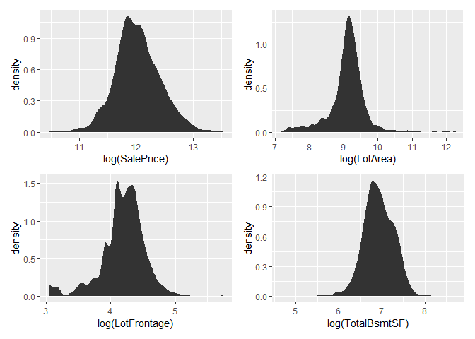

House_prices
================
Joao Lazzaro

I created this notebook to understand how Kaggle works. It estimates a
simple Lasso model to predict house prices in the [Kaggle house prices
competition](https://www.kaggle.com/c/house-prices-advanced-regression-techniques).

### HOUSEKEEPING

``` r
setwd("C:\\Users\\jgsla\\OneDrive\\kaggle\\house_prices")
library(lubridate)
library(ggplot2)
library(corrplot)
library(Amelia)
library(GGally)
library(corrr)
library(tidymodels)
library(recipeselectors)
library(tidyverse)
library(patchwork)
```

### Load Data

``` r
training <- tibble(read.csv("data\\train.csv"))
test <- tibble(read.csv("data\\test.csv")) %>%
  mutate(SalePrice = 0)
```

# Data Cleaning

##### Checking for missing

<!-- --> Dropping the
variables with more than 15% missing.

``` r
training <- training %>%
    select(which(colMeans(is.na(training)) < 0.3))
test <- test %>%
    select(names(training))
```

<!-- -->

Transform into dummies, when applicable

``` r
rp <- recipe(SalePrice ~ ., data = training) %>%
    update_role(Id, new_role = "ID") %>%
    step_dummy(all_nominal(), -all_outcomes()) %>%
    prep(training = training)
 

training <- bake(rp, new_data = training)
test <- bake(rp, new_data = test)
```

### Exploratory Data Analysis

Distribution of some numerical variables

<!-- -->

SalePrice, LotArea, LotFrontage and TotalBsmtSF are right skewed, let’s
see with log transformation:
<!-- -->

So I’ll transform them to log

``` r
training <- training %>%
    mutate(SalePrice = log(SalePrice),
      LotArea = log(LotArea),
      LotFrontage = log(LotFrontage),
      TotalBsmtSF = log(TotalBsmtSF))
test <- test %>%
    mutate(LotArea = log(LotArea),TotalBsmtSF = log(TotalBsmtSF),
    LotFrontage = log(LotFrontage))
```

Let’s check the relationship of SalePrice with these numerical variables

    ## `geom_smooth()` using method = 'gam' and formula 'y ~ s(x, bs = "cs")'

    ## `geom_smooth()` using formula 'y ~ x'

<!-- -->

The linear model seems a good candidate and there seems to be a
quadratic relationship with the year built. Let’s add a quadratic term.

``` r
training <- training %>%
    mutate(YearBuilt2 = YearBuilt^2)
test <- test %>%
    mutate(YearBuilt2 = YearBuilt^2)
```

#### Correlations

Matrix:

    ## 
    ## Correlation method: 'pearson'
    ## Missing treated using: 'pairwise.complete.obs'

    ## Don't know how to automatically pick scale for object of type noquote. Defaulting to continuous.

<!-- -->

Numbers of the 10 first:

``` r
recipe(SalePrice ~ ., data = training) %>%
    update_role(Id, new_role = "ID") %>%
    step_dummy(all_nominal()) %>%
    step_impute_mean(all_numeric()) %>%
    prep() %>%
    juice() %>%
    correlate() %>%
    select(c(1:10)) %>%
    head(10) %>%
    shave() %>%
    fashion()
```

    ## 
    ## Correlation method: 'pearson'
    ## Missing treated using: 'pairwise.complete.obs'

    ##            term   Id MSSubClass LotFrontage LotArea OverallQual OverallCond
    ## 1            Id                                                            
    ## 2    MSSubClass  .01                                                       
    ## 3   LotFrontage -.02       -.48                                            
    ## 4       LotArea -.02       -.46         .65                                
    ## 5   OverallQual -.03        .03         .21     .18                        
    ## 6   OverallCond  .01       -.06        -.03    -.01        -.09            
    ## 7     YearBuilt -.01        .03         .08     .02         .57        -.38
    ## 8  YearRemodAdd -.02        .04         .06     .03         .55         .07
    ## 9    MasVnrArea -.05        .02         .14     .12         .41        -.13
    ## 10   BsmtFinSF1 -.01       -.07         .16     .23         .24        -.05
    ##    YearBuilt YearRemodAdd MasVnrArea
    ## 1                                   
    ## 2                                   
    ## 3                                   
    ## 4                                   
    ## 5                                   
    ## 6                                   
    ## 7                                   
    ## 8        .59                        
    ## 9        .31          .18           
    ## 10       .25          .13        .26

Correlations histogram:

    ## 
    ## Correlation method: 'pearson'
    ## Missing treated using: 'pairwise.complete.obs'

    ## `stat_bin()` using `bins = 30`. Pick better value with `binwidth`.

<!-- -->

There is low correlations between most predictors

### Finding the best Lasso regression

1 - Defining the model

``` r
rp <- recipe(SalePrice ~ ., data = training) %>%
    update_role(Id, new_role = "ID")
model <- linear_reg(penalty = tune()) %>%
    set_engine("glmnet")
wf <- workflow() %>%
    add_recipe(rp) %>%
    add_model(model)
```

2 - Defining hyperparameters with a coarse grid

``` r
params <- parameters(wf)
grid <- tibble(penalty = seq(0, 1, by = 0.1))   #grid_random(params, size = 10)
grid
```

    ## # A tibble: 11 x 1
    ##    penalty
    ##      <dbl>
    ##  1     0  
    ##  2     0.1
    ##  3     0.2
    ##  4     0.3
    ##  5     0.4
    ##  6     0.5
    ##  7     0.6
    ##  8     0.7
    ##  9     0.8
    ## 10     0.9
    ## 11     1

3 - Define training/validadtion data size

``` r
cv_splits <- vfold_cv(training, v = 10, strata = SalePrice)
```

4 - Train the model

``` r
res <- wf %>% tune_grid(resamples = cv_splits, grid = grid)
```

    ## ! Fold01: internal: o desvio padrão é zero

    ## ! Fold02: internal: o desvio padrão é zero

    ## ! Fold03: internal: o desvio padrão é zero

    ## ! Fold04: internal: o desvio padrão é zero

    ## ! Fold05: internal: o desvio padrão é zero

    ## ! Fold06: internal: o desvio padrão é zero

    ## ! Fold07: internal: o desvio padrão é zero

    ## ! Fold08: internal: o desvio padrão é zero

    ## ! Fold09: internal: o desvio padrão é zero

    ## ! Fold10: internal: o desvio padrão é zero

5 - RMSE plots:

``` r
autoplot(res, metric = "rmse") +
    xlim(0,1)
```

    ## Scale for 'x' is already present. Adding another scale for 'x', which will
    ## replace the existing scale.

<!-- -->

Note that the RMSE seems to be increasing in the regularization
parameter for larger values. Lets do it again with a finer grid in
between the points we already know: 0, 0.3 .

``` r
grid <- tibble(penalty = seq(0, 0.3, by = 0.001))   #grid_random(params, size = 10)
res <- wf %>% tune_grid(resamples = cv_splits, grid = grid)
autoplot(res, metric = "rmse") +
    xlim(0,0.3)
```

    ## Scale for 'x' is already present. Adding another scale for 'x', which will
    ## replace the existing scale.

<!-- -->

Now we see that there is a minimum, we can try an even finer grid

``` r
grid <- tibble(penalty = seq(0, 0.1, by = 0.0001))   #grid_random(params, size = 10)
res <- wf %>% tune_grid(resamples = cv_splits, grid = grid)
autoplot(res, metric = "rmse") +
    xlim(0, 0.1)
```

    ## Scale for 'x' is already present. Adding another scale for 'x', which will
    ## replace the existing scale.

<!-- -->

6 - Select the best model

``` r
res %>% show_best("rmse", metric = "rmse")
```

    ## # A tibble: 1,001 x 7
    ##    penalty .metric .estimator  mean     n std_err .config                
    ##      <dbl> <chr>   <chr>      <dbl> <int>   <dbl> <chr>                  
    ##  1  0.0044 rmse    standard   0.142    10  0.0113 Preprocessor1_Model0045
    ##  2  0.0047 rmse    standard   0.142    10  0.0113 Preprocessor1_Model0048
    ##  3  0.0045 rmse    standard   0.142    10  0.0113 Preprocessor1_Model0046
    ##  4  0.0046 rmse    standard   0.142    10  0.0113 Preprocessor1_Model0047
    ##  5  0.0048 rmse    standard   0.142    10  0.0113 Preprocessor1_Model0049
    ##  6  0.0043 rmse    standard   0.142    10  0.0114 Preprocessor1_Model0044
    ##  7  0.0049 rmse    standard   0.142    10  0.0113 Preprocessor1_Model0050
    ##  8  0.0042 rmse    standard   0.142    10  0.0114 Preprocessor1_Model0043
    ##  9  0.005  rmse    standard   0.142    10  0.0113 Preprocessor1_Model0051
    ## 10  0.0041 rmse    standard   0.142    10  0.0114 Preprocessor1_Model0042
    ## # ... with 991 more rows

7 - Fit the best model to the training data and calculate the RMSE

``` r
final_wf <-
  wf %>%
  finalize_workflow(select_best(res, metric = "rmse"))
final_fit <-
  final_wf %>%
  fit(training)
rmse(training, training$SalePrice, predict(final_fit, training)$.pred)
```

    ## # A tibble: 1 x 3
    ##   .metric .estimator .estimate
    ##   <chr>   <chr>          <dbl>
    ## 1 rmse    standard       0.122

``` r
training %>%
    mutate(pred = predict(final_fit, training)$.pred, residuals = SalePrice - pred) %>%
    select(SalePrice, pred) %>%
    pivot_longer(cols = c(pred),
                      names_to = "predictor", values_to = "value") %>%
  ggplot(aes(x = value, SalePrice)) +
  geom_point(alpha = .2) + 
#  geom_smooth(color="red") +
  geom_smooth(method='lm',color='yellow') +
  facet_wrap(~ predictor, scales = "free_x")
```

    ## `geom_smooth()` using formula 'y ~ x'

<!-- -->

``` r
rp2 <- recipe(training) %>%
  step_impute_knn(all_numeric()) %>%
  prep()
training2 <- rp2 %>% bake(training)
rmse(training2, training2$SalePrice, predict(final_fit, training2)$.pred)
```

    ## # A tibble: 1 x 3
    ##   .metric .estimator .estimate
    ##   <chr>   <chr>          <dbl>
    ## 1 rmse    standard       0.122

8 - Fit the model to the test data, but first input knn on missing

``` r
test <- rp2 %>%
  bake(test)

test_pred <- exp(predict(final_fit, test))
```

9 - Save into csv

``` r
tibble(Id = test$Id, SalePrice = test_pred$.pred) %>%
    write_csv(file = "submission_JoaoLazzaro.csv", na = "")
```
